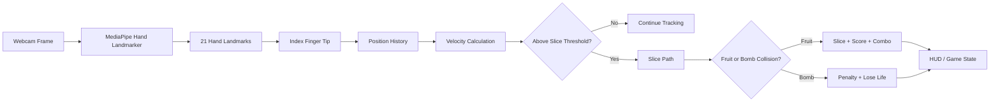

# Fruit Ninja — Real-Time Hand Tracking

[](https://github.com/alaamadii/ninja-fruite-computervision/actions/workflows/ci.yml)

A real-time Computer Vision game that turns webcam hand movement into Fruit Ninja-style slicing. The application combines MediaPipe hand landmarks, index-finger motion tracking, velocity-based gesture detection, fruit/bomb collision logic, scoring, combos, lives, and game-over state in one interactive Python application.

**Portfolio focus:** Computer Vision · real-time vision pipelines · gesture recognition · game-state engineering · automated testing · CI

## Engineering Highlights

- Detects up to two hands from a live webcam feed using MediaPipe Hand Landmarker.
- Tracks the index-finger tip across frames and calculates motion velocity in pixels/second.
- Triggers slice gestures only when hand velocity crosses a configurable threshold.
- Uses the gesture path for fruit and bomb interaction rather than treating every detected hand position as a hit.
- Implements delta-time-aware fruit physics with gravity and configurable spawn/velocity ranges.
- Separates hand tracking, gesture detection, fruit/bomb behavior, spawning, HUD, and game-state management into focused modules.
- Includes scoring, combo growth/timeout, bomb penalties, lives, missed-fruit penalties, and game-over handling.
- Runs automated correctness checks, source compilation, and core-logic tests in GitHub Actions.

## Vision-to-Gameplay Pipeline



## Implemented Gameplay

- Live camera gameplay
- 21-point MediaPipe hand landmark detection
- Two-hand support
- Index-finger slicing gestures
- Velocity-based gesture thresholding
- Fruit spawning and gravity-based physics
- Multiple fruit types with emoji rendering
- Fruit collision and slicing
- Bomb obstacles and score penalties
- Score and combo system
- Lives and missed-fruit penalties
- Game-over condition
- Real-time HUD and visual hand trails
- Configurable gameplay and tracking parameters

## Tech Stack

- Python
- OpenCV
- MediaPipe Tasks / Hand Landmarker
- NumPy
- Pillow
- Pygame
- `unittest`
- Ruff
- GitHub Actions

## Project Structure

```text
ninja-fruite-computervision/
├── main.py                      # Application entry point and gameplay orchestration
├── config.py                    # Tracking, physics, scoring, and UI configuration
├── hand_landmarker.task         # MediaPipe hand-landmark model
├── requirements.txt
├── pyproject.toml               # Ruff configuration
├── game/
│   ├── bomb.py                  # Bomb behavior and rendering
│   ├── fruit.py                 # Fruit physics, rendering, and collision helpers
│   ├── fruit_spawner.py         # Fruit/bomb spawning and lifecycle
│   ├── game_engine.py           # Camera, frame timing, and display management
│   ├── game_manager.py          # Score, combo, lives, and game-over state
│   └── gesture_detector.py      # Velocity-based slicing detection
├── vision/
│   └── hand_tracker.py          # Canonical MediaPipe Hand Landmarker wrapper
├── ui/
│   └── hud.py                   # Score/lives/combo overlay
├── tests/
│   └── test_core_logic.py       # Game-state, gesture, and fruit-physics tests
└── .github/workflows/ci.yml     # Automated quality checks
```

## Getting Started

### Requirements

- Python 3.10+
- Webcam

### Install

```bash
git clone https://github.com/alaamadii/ninja-fruite-computervision.git
cd ninja-fruite-computervision
python -m venv .venv
```

Activate the environment:

```bash
# Windows
.venv\Scripts\activate

# macOS/Linux
source .venv/bin/activate
```

Install dependencies:

```bash
python -m pip install --upgrade pip
pip install -r requirements.txt
```

### Run

```bash
python main.py
```

Controls:

- Move your index finger quickly across a fruit to slice it.
- Avoid bombs.
- Press `Q` or `ESC` to quit.

## How Slice Detection Works

`GestureDetector` stores a short history of index-finger positions for each detected hand. It compares the oldest and newest samples in that history, calculates displacement and elapsed time, and converts them into movement velocity. A slice is emitted only when that velocity reaches the configured threshold.

This keeps the interaction tied to deliberate fast motion instead of treating a stationary fingertip over a fruit as a slice.

The main gameplay loop then uses the detected slice path to check interactions with active fruits and bombs before updating score, combo, lives, and HUD state.

## Configuration

`config.py` exposes the main tuning parameters, including:

- Resolution and target FPS
- Hand detection/tracking confidence
- Maximum number of hands
- Fruit spawn rate and radius
- Gravity and velocity ranges
- Gesture velocity threshold
- Gesture history size
- Scoring, combo bonus, bomb penalty, and initial lives

## Automated Quality Checks

The GitHub Actions workflow installs the project, runs Ruff correctness checks, compiles all Python sources, and executes the core-logic test suite.

Run the same checks locally with:

```bash
ruff check .
python -m compileall -q .
python -m unittest discover -s tests -v
```

The current tests focus on deterministic logic that can be verified without a webcam: scoring/combo behavior, lives and game-over transitions, gesture-speed thresholds, hand-history cleanup, fruit movement, slicing state, and circular point collision.

## Current Limitations

- Real-time behavior depends on webcam quality, lighting, hand visibility, and machine performance.
- Gesture thresholds are heuristic and may need tuning for different camera resolutions or users.
- Automated CI validates deterministic game logic but cannot validate webcam/MediaPipe behavior on a physical camera.
- The project currently focuses on the playable Computer Vision interaction rather than menu/audio/high-score polish.

## Possible Future Improvements

- Recorded-video integration tests for the vision pipeline
- Configurable difficulty levels
- Sound effects and menu/game-over screens
- High-score persistence
- Performance profiling and adaptive frame processing
- More advanced gesture classification beyond velocity thresholding

## Author

**Alaa Madi** — Software Engineering / Machine Learning & Computer Vision
